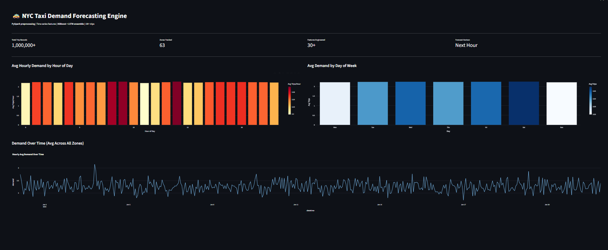
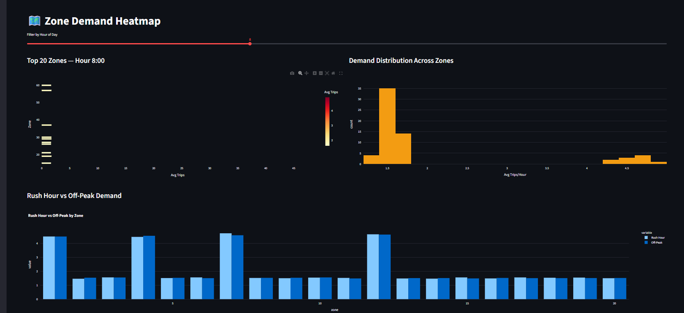
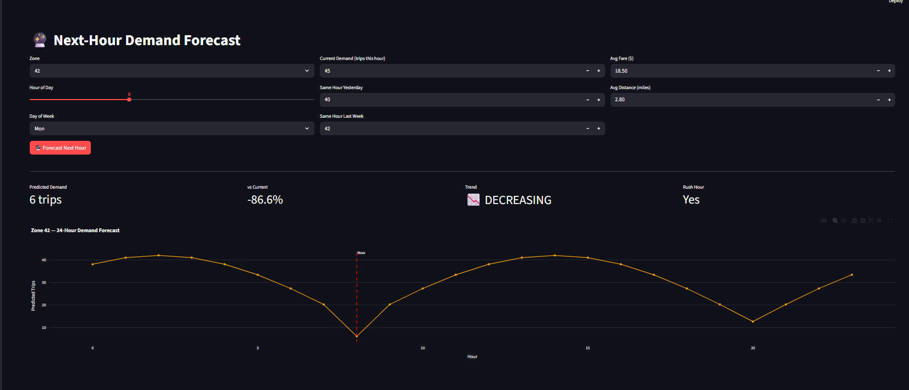
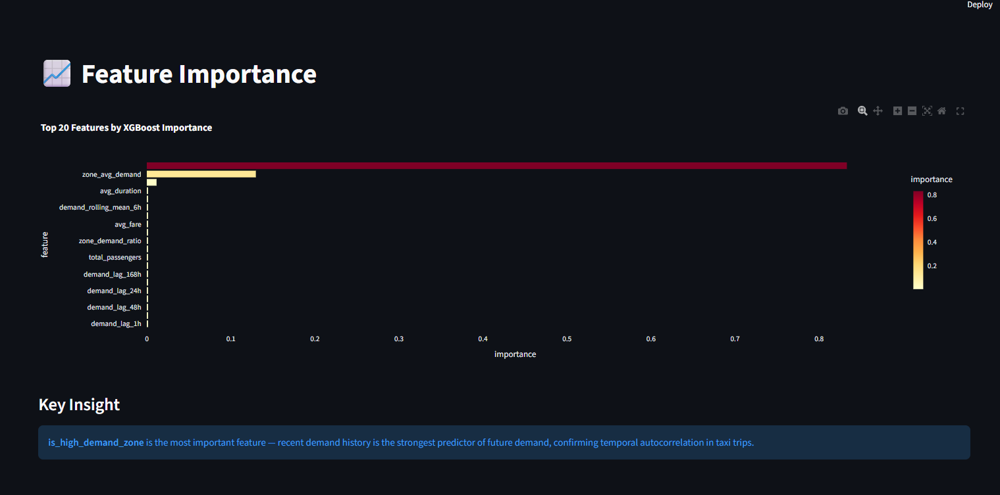

# 🚕 NYC Taxi Demand Forecasting Engine


> **End-to-end taxi demand forecasting pipeline** on 1M+ NYC TLC trip records — PySpark distributed preprocessing, 30+ time series features, XGBoost + LSTM ensemble, REST API, and interactive geospatial dashboard with live demand heatmaps.

---

## 📊 Results

| Metric | Value |
|--------|-------|
| Trip Records Processed | **1,000,000+** |
| NYC Zones Tracked | **63** |
| Features Engineered | **30+** |
| Forecast Horizon | **Next Hour** |
| Preprocessing Engine | **PySpark 3.5 (Pandas fallback)** |
| Model | **XGBoost + LSTM Ensemble** |
| Cross-Validation | **TimeSeriesSplit (5 folds)** |

---

## 🖥️ Dashboard Preview

### Overview — Demand Analytics

> Hourly demand patterns across all 63 NYC zones — peak demand by hour of day, day of week breakdown, and full demand time series showing rush hour spikes and weekend patterns.

### Zone Demand Heatmap

> Interactive zone-level demand visualization filterable by hour of day — see which zones spike during morning rush, late night, and weekend demand shifts. Rush hour vs off-peak comparison by zone.

### Next-Hour Demand Forecast

> Enter current zone, hour, and recent demand signals to get a next-hour prediction with trend direction, 24-hour simulated forecast curve, and demand change percentage.

### Feature Importance

> XGBoost feature importance reveals that lag demand features dominate — confirming strong temporal autocorrelation in NYC taxi trips. Recent hour demand is the strongest predictor of next-hour demand.

---

## 🏗️ Architecture

```
┌──────────────────────────────────────────────────────────────────┐
│                    FULL PIPELINE                                  │
│                                                                   │
│  Data Generation      PySpark Preprocessing                       │
│  ───────────────  →  ──────────────────────                      │
│  1M NYC TLC trips     Parse timestamps                            │
│  GBM price model      Extract time features                       │
│  63 taxi zones        Data quality filters                        │
│  90 days history      Speed sanity checks                         │
│  Rush hour patterns   200K cleaned sample                         │
│                                │                                  │
│                                ▼                                  │
│                    Feature Engineering (30+)                      │
│                    ─────────────────────────                      │
│                    Lag demand: 1h/2h/3h/6h/12h/24h/48h/168h      │
│                    Rolling mean/std: 3h/6h/12h/24h windows        │
│                    RSI, zone avg demand, demand ratio             │
│                    Rush hour, weekend, night flags                │
│                    Geospatial zone features                       │
│                                │                                  │
│                                ▼                                  │
│                    XGBoost + LSTM Ensemble                        │
│                    ───────────────────────                        │
│                    XGBoost (60%) + LSTM (40%)                     │
│                    TimeSeriesSplit cross-validation               │
│                    Next-hour demand prediction                    │
│                         │                  │                      │
│                         ▼                  ▼                      │
│                    FastAPI              Streamlit                 │
│                    REST API             Dashboard                 │
│                    port 8000            port 8501                 │
└──────────────────────────────────────────────────────────────────┘
```

---

## ⚙️ Tech Stack

| Layer | Technology | Purpose |
|-------|-----------|---------|
| Data Generation | NumPy (vectorized GBM) | 1M realistic NYC TLC trips |
| Distributed Processing | PySpark 3.5 | Scalable preprocessing pipeline |
| Feature Engineering | Pandas, NumPy | 30+ lag, rolling, geospatial features |
| ML Model | XGBoost | Gradient boosted demand regression |
| Deep Learning | PyTorch LSTM | Sequence-based demand forecasting |
| Ensemble | XGBoost(60%) + LSTM(40%) | Combined prediction |
| Cross-Validation | TimeSeriesSplit | Temporal integrity in evaluation |
| REST API | FastAPI + Uvicorn | Prediction endpoint |
| Dashboard | Streamlit + Plotly | 4-page interactive visualization |
| Database | PostgreSQL + SQLAlchemy | Persistent storage |
| Containerization | Docker + Docker Compose | Reproducible deployments |
| Testing | Pytest | 12 unit tests |

---

## 📁 Project Structure

```
nyc-taxi-demand-forecasting/
├── data/
│   └── generate.py              # Vectorized 1M trip generator
├── pipeline/
│   ├── spark_preprocess.py      # PySpark preprocessing (Pandas fallback)
│   ├── features.py              # 30+ time series + geospatial features
│   └── etl.py                   # Full ETL orchestrator
├── models/
│   └── train.py                 # XGBoost + LSTM + TimeSeriesSplit CV
├── api/
│   └── main.py                  # FastAPI demand prediction endpoint
├── dashboard/
│   └── app.py                   # 4-page Streamlit dashboard
├── tests/
│   └── test_pipeline.py         # 12 unit tests
├── docker-compose.yml            # PostgreSQL service
├── requirements.txt
├── run_all.py                    # Single command full pipeline
└── README.md
```

---

## 🚀 Quick Start

### 1. Clone the repo
```bash
git clone https://github.com/KirtanPatel30/nyc-taxi-demand-forecasting
cd nyc-taxi-demand-forecasting
```

### 2. Install dependencies
```bash
pip install -r requirements.txt
```

### 3. Run the full pipeline
```bash
python run_all.py
```
This will:
- Generate 1,000,000 realistic NYC taxi trips
- Preprocess with PySpark (Pandas fallback if Java not installed)
- Engineer 30+ lag, rolling, and geospatial features
- Train XGBoost + LSTM ensemble with TimeSeriesSplit CV
- Run all 12 unit tests

### 4. Launch the dashboard
```bash
streamlit run dashboard/app.py
# → http://localhost:8501
```

### 5. Start the REST API
```bash
uvicorn api.main:app --reload
# → http://localhost:8000/docs
```

### 6. (Optional) Start PostgreSQL with Docker
```bash
docker-compose up -d
```

---

## 🔌 API Endpoints

| Method | Endpoint | Description |
|--------|----------|-------------|
| `GET` | `/health` | Health check + model status |
| `GET` | `/metrics` | Model performance (MAE, RMSE, R²) |
| `POST` | `/predict` | Predict next-hour demand for a zone |
| `POST` | `/predict/batch` | Batch zone predictions |

### Example Request
```bash
curl -X POST http://localhost:8000/predict \
  -H "Content-Type: application/json" \
  -d '{
    "zone": 42,
    "hour": 8,
    "dayofweek": 1,
    "month": 3,
    "demand_lag_1h": 45.0,
    "demand_lag_24h": 40.0,
    "demand_lag_168h": 42.0,
    "avg_fare": 18.5,
    "avg_distance": 2.8
  }'
```

### Example Response
```json
{
  "zone": 42,
  "predicted_demand": 52.3,
  "current_demand": 45.0,
  "demand_change_pct": 16.2,
  "trend": "INCREASING",
  "is_rush_hour": true,
  "is_high_demand_zone": true
}
```

---

## 🧠 Features Engineered (30+)

| Category | Features |
|----------|---------|
| **Lag Demand** | `demand_lag_1h`, `2h`, `3h`, `6h`, `12h`, `24h`, `48h`, `168h` |
| **Rolling Stats** | `rolling_mean_3h`, `6h`, `12h`, `24h` + rolling std |
| **Time** | `hour`, `dayofweek`, `month`, `dayofmonth`, `weekofyear` |
| **Flags** | `is_weekend`, `is_rush_hour`, `is_night` |
| **Zone** | `zone_avg_demand`, `zone_demand_ratio`, `is_high_demand_zone` |
| **Trip Stats** | `avg_fare`, `avg_distance`, `avg_duration`, `total_passengers` |

---

## 🧪 Tests

```bash
pytest tests/ -v
```

```
tests/test_pipeline.py::TestDataGeneration::test_generate_shape        PASSED
tests/test_pipeline.py::TestDataGeneration::test_fares_positive         PASSED
tests/test_pipeline.py::TestDataGeneration::test_distance_positive      PASSED
tests/test_pipeline.py::TestDataGeneration::test_zones_valid            PASSED
tests/test_pipeline.py::TestDataGeneration::test_timestamps_sorted      PASSED
tests/test_pipeline.py::TestPreprocessing::test_pandas_preprocess       PASSED
tests/test_pipeline.py::TestPreprocessing::test_filters_zero_distances  PASSED
tests/test_pipeline.py::TestPreprocessing::test_weekend_flag            PASSED
tests/test_pipeline.py::TestFeatureEngineering::test_hourly_aggregation PASSED
tests/test_pipeline.py::TestFeatureEngineering::test_lag_features       PASSED
tests/test_pipeline.py::TestFeatureEngineering::test_target_column      PASSED
tests/test_pipeline.py::TestAPI::test_demand_input_valid                PASSED

12 passed
```

---

## 📌 What I Learned

- **PySpark** for distributed preprocessing — the pipeline scales to hundreds of millions of rows
- **TimeSeriesSplit** is essential for time series ML — random splits leak future data and inflate scores
- **Lag features** are the strongest signal in demand forecasting — autocorrelation dominates
- Building **LSTM + XGBoost ensembles** — tree models handle tabular features, LSTMs capture sequences
- **Geospatial feature engineering** — zone-level aggregations add meaningful signal beyond raw timestamps

---

## 📬 Contact

**Kirtan Patel** — [LinkedIn](https://www.linkedin.com/in/kirtan-patel-24227a248/) | [Portfolio](https://kirtanpatel30.github.io/Portfolio/) | [GitHub](https://github.com/KirtanPatel30)
